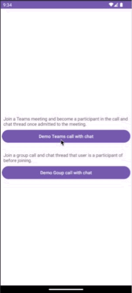

# Calling with Chat using UI Libraries Sample for Android

The sample is a native Android application that uses the Azure Communication Services Android [Calling UI library](https://docs.microsoft.com/en-us/azure/communication-services/quickstarts/ui-library/get-started-composites?tabs=kotlin&pivots=platform-android) and [Chat UI library](https://learn.microsoft.com/en-us/azure/communication-services/quickstarts/ui-library/get-started-chat-ui-library?tabs=kotlin&pivots=platform-android) to build a calling with chat experience that features both voice and video calling and chat. The application uses a server-side component to provision access tokens that are then used to initialize the Azure Communication Services client library. To configure this server-side component, feel free to follow the [Trusted Service with Azure Functions](https://docs.microsoft.com/azure/communication-services/tutorials/trusted-service-tutorial) tutorial.

Additional documentation for this sample can be found on [Microsoft Docs](https://docs.microsoft.com/en-us/azure/communication-services/samples/calling-hero-sample?pivots=platform-android). See this sample's wiki to see updated information on [known issues](https://github.com/Azure-Samples/communication-services-calling-ui-with-chat-android/issues)

## Features

This project framework provides the following features:

* Join a Teams meeting call and it's chat 
* Join a Group Call and a chat thread

## Getting Started

### Prerequisites

- An Azure account with an active subscription. [Create an account for free](https://azure.microsoft.com/free/?WT.mc_id=A261C142F).
- A deployed Communication Services resource. [Create a Communication Services resource](../create-communication-resource.md).
- A user access token to enable the call and chat composites. [Get a user access token](../access-tokens.md).
- An OS running [Android Studio](https://developer.android.com/studio).
- Optional: Completion of the [quickstart for getting started with the UI Library composites](get-started-composites.md).

### Quickstart

1. git clone this repository
1. Open CallingWithChat directory with Android Stidio
1. Go to `GroupCallWithChatActivity` and `TeamsMeetingActivity` and update following:
    - Replace `TEAM_MEETING_LINK` with the Teams meeting link.
    - Replace `GROUP_ID` with the Teams meeting link.
    - Replace `ACS_ENDPOINT` with your ACS resource's endpoint.
    - Replace `DISPLAY_NAME` with your name.
    - Replace `USER_ID` with ACS user ID.
    - Replace `USER_ACCESS_TOKEN` with your token.
1. Run the App

## Resources

- [Calling UI library](https://docs.microsoft.com/en-us/azure/communication-services/quickstarts/ui-library/get-started-composites?tabs=kotlin&pivots=platform-android) 
- [Chat UI library](https://learn.microsoft.com/en-us/azure/communication-services/quickstarts/ui-library/get-started-chat-ui-library?tabs=kotlin&pivots=platform-android)
